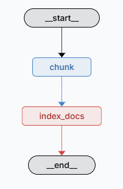
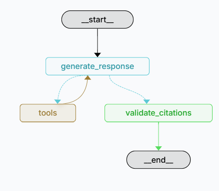

# 10-K Agent Architecture

## Overview

RAG system for analyzing 10-K financial filings built with:
- **LangGraph** - Agent orchestration
- **PostgreSQL + pgvector** - Vector storage
- **Jinja2** - Prompt templating

## System Components

### 1. Indexing Agent

Processes 10-K filings into searchable chunks

### 2. React Agent (Query Processing)

Handles user queries with ReAct pattern (Reasoning + Acting)

---

## Indexing Pipeline

### Stage 1: Document Parsing
- Load 10-k filing using Edgar tools
- Creating StructuralNodes (Text / Table / Image) with document location metadata (item, page...).
- Creating structured table representation
- Build a SemanticDocument that allows to access StructuralNodes (Text / Table / Image), while retaining document structure information (Item, page ect...). 

### Stage 2: Intelligent Chunking
- Merge StructuralNodes by configurable parameters:
  - Chunk size limits
  - Overlap settings
  - Semantic boundaries
- Preserve item boundaries and table integrity
- Propagate source metadata to each chunk

### Stage 3: Vector Embedding & Storage
- Generate vector embeddings for text chunks
- Store in PostgreSQL with pgvector
- Maintain structured metadata

## Query Processing
### Available Tools

- **document_qa**: Search indexed 10-K documents
- **search**: Web search for current information  
- **get_agent_available_data**: Return available filing info. (currently hardcoded, can be injected into prompt, but since the agent supports indexing any number of filings for different companies, this tool is included ) 

Tools are injected via @tool langragh annotation, that provides the model with tool description , parameters etc..

The Reasoning node decides which tool to use.

In addition, specific instructions for tools are managed in prompt.

## Technical Details
### Prompt Management
- Location: `/src/react_agent/prompts/`
- Jinja2 templates for dynamic generation
- Modular structure for different functions

